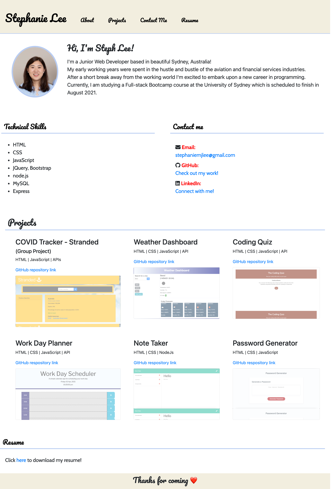

# Portfolio-page
Stephanie Lee portfolio page

# Description 
* Use HTML and CSS to create a simple portfolio page.

# Table of contents
* GitHub Repository URL
* Deployed URL
* Screenshot of profile page

# My GitHub Repository URL 
https://github.com/smj3085/Portfolio_StephLee

# Deployed URL
https://smj3085.github.io/Portfolio_StephLee/

# Screenshot
